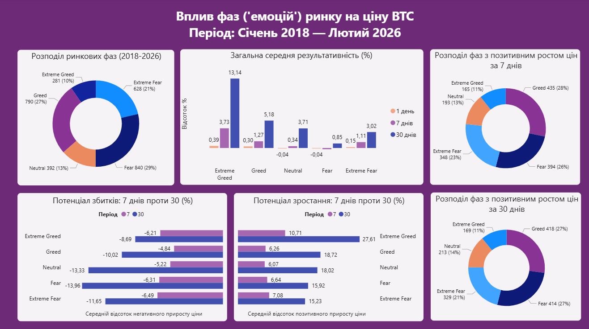

# Btc_analysis
## Опис
Цей проект досліджує кореляцію між емоційним станом ринку (індекс Fear & Greed) та фактичною динамікою ціни Bitcoin (BTC). Мета аналізу — з'ясувати, чи є екстремальні настрої надійними для прогнозування прибутковості протягом різних часових діапазонів (1, 7 та 30 днів).

## Програми
* **Python (Pandas, yfinance):** Збір та очищення історичних даних.
* **SQL Server:** Обробка та аналіз даних та створення Views.
* **Power BI:** Створення дашборду для візуалізації ризиків та прибутку.

## Етапи роботи
**1** Для проекту обрано дані з сайту який аналізує емоції та настрої з різних джерел і об'єднує їх в одне просте число: індекс страху і жадібності для біткойна. Цей індекс йде у дапазоні від 0 - Extreme Fear до 100 - Extreme Greed. Актуальні ціни на біткоїн було взято з Yahoo Finance, за допомогою бібліотеки yfinance. Так як дані індексу страху та жадібності починаються з лютого 2018 року то і дані про ціни були узяті з тієї самої дати. Загалом діапазон у цьому проекті: 17 лютого 2026 - 5 лютого 2018. Дані були об'єднані в одну dataframe.
**2** Аналіз у SQL починався з перевірки середніх цін за настроями(extreme greed, greed, neutral, fear, extreme fear). За остаточне визначення цін було взято колонку Close з yahoo finance яка означає ціну біткоїна на час закритя біржі, і в подальшому використовувалася лише ця ціна. Аналіз виконувався для визначення величини змін цін за різними періодами (1/7/30 днів) та групування їх за настроями.
**3** Візуалізація дашбоду складається з Кількості днів у яких емоціях перебував ринок - загальна сукупність днів усіх даних за емоціями. Кількість днів з позитивним зростанням цін за 7/30 днів - кількість днів у яких зростання ціни було більше 0. Також Загальна середня результативність за 1/7/30 днів - середній відсоток зміни ціни. Потенціали зростання та звитків за 7/30 днів - средній відсоток окремо по негативих та позитивних значеннях.

## Висновки
Хоча середня ціна в стані Fear є найнижчою (що робить цей стан привабливим для довгострокових інвесторів), мої розрахунки прибутковості показали що Extreme Greed має сильний ефект інерції. В цьому стані ринок демонструє найшвидший приріст капіталу як і за 7 днів (3.7%) так і за 30 днів (13%), навіть попри те що точка входу є вищою за середню. Якщо дивитись з боку збитковості короткостроково (7 днів) Extreme Greed є таким же ризикованим як і Extreme Fear (по ~6%), на дистанції 30 днів він стає найбільш безпечним та прибутковим станом з середнім рівнем збитковості -8%, що є найменшою цифрою з поміж усіх емоцій.
Найпоширеніша емоція у якій пребував ринок за увесь час це Fear (840 днів), також він має найнижчий ріст цін за періоди 1/7/30 днів. Тобто це найважчий час для заробітку. Extreme Greed зустрічається найрідше (лише 281 день), він є найменш тривалим що вказує на його нестабільність. Це свідчить про те що ринок не може довго перебувати на піку. У стані Greed ринок також перебував довгий час (790 днів), це свідчить про стабільну динаміку. Ринок залишається в цьому стані, бо він комфортний: ціна потроху змінюється, збитки не найбільші. Емоція Neutral у середньому має скачки ціни на рівні 49.23%. Це єдиний стан (окрім Fear) де шанси вгадати рух ціни менші за 50/50, на ринку немає чіткої емоції (нейтральність), ціна рухається хаотично.
Загалом всупереч стереотипам стан Extreme Greed продемонстрував найвищу ефективність на дистанції 30 днів що свідчить про силу тренду в моменти ейфорії. А на короткому відрізку (7 днів) Extreme Greed є періодом максимальної агресивності ринку: він дає найвищі шанси на швидкий прибуток але водночас несе в собі ризик найбільших різких корекцій. Своєю чергою стан Neutral демонструє відсутність чіткого напрямку, де шанси на ріст або падіння є майже рівними (близько 50%).
Ринок перебуває у стані оптимізму (Greed) майже стільки ж скільки у стані страху, що підтверджує глобальну тенденцію циклічності біткоїна протягом останніх 8 років.
Важливе зауваження:
Криптовалютний ринок характеризується екстремальною волатильністю. Цей аналіз базується на історичних даних і не є гарантією майбутніх результатів. Жоден індикатор не може передбачити рух ціни на 100%, проте розуміння статистичних закономірностей дозволяє приймати рішення на основі цифр а не емоцій.

